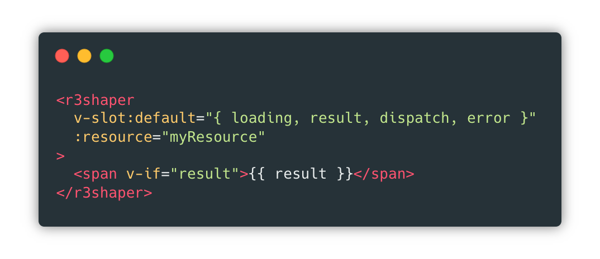

<p align="center">
  
</p>

<p align="center">
✨R3shaper Vue fetch component ✨
</p>

<p align="center">
  
  
  
  <a href="https://twitter.com/home?status=https%3A//github.com/coltor-apps/r3shaper-vue">
    
  </a>
</p>

<p align="center">
  
</p>

> Note: Proper documentation coming soon.

### Installation

```shell
npm install r3shaper r3shaper-vue --save
```
or
```shell
yarn add r3shaper r3shaper-vue
```

### Props

| Prop     | Type          | Required | Default | Description                                                          |
|----------|---------------|----------|---------|----------------------------------------------------------------------|
| resource | Function      | true     |         | R3shaper resource.                                                   |
| manual   | Boolean       | false    | false   | Whether the request should be dispatched manually.                   |
| tag      | String / Null | false    | "div"   | Wrapper element tag. If null, only the first child will be rendered. |
| debounce | Number        | false    | 0       | Request debounce interval.                                           |
| throttle | Number        | false    | 0       | Request throttle interval.                                           |

### Default Slot - Scope

| Prop     | Type                                                     | Description                         |
|----------|----------------------------------------------------------|-------------------------------------|
| loading  | Boolean                                                  | True if the request is in progress. |
| dispatch | Function(options = {}, reducer = function(oldResult, newResult)) | Request trigger.                    |
| result   | Any                                                    | Request result.                     |
| error    | Any                                                    | Request error.                      |


## Dependencies

- [*r3shaper ^0.1.6*](https://github.com/coltor-apps/r3shaper)
- [*vue ^2.6.10*](https://github.com/vuejs/vue)

## Credits

Created by [Stratulat Alexandru](https://twitter.com/sandulat).

<a href="https://coltorapps.com/">
  
</a>
